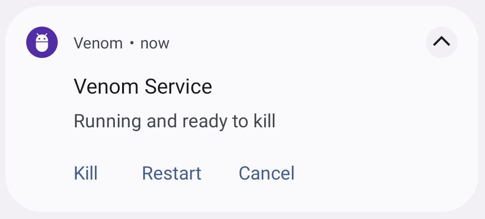

# Venom

[](https://jitpack.io/#YarikSOffice/venom)



**Venom** is a lightweight tool that simplifies testing of the process death scenario for your android application. 

## Why Venom?

The Android Run Time aggressively manages its resources and occasionally terminates background applications while the user is away interacting with other apps. In such a case, all the activities are destroyed along with application scope objects and background tasks. 

When the user relaunches the app, the top stack activity is restored from the saved instance state. Knowing this, your applications should always present a consistent interface and be tested against the process death scenario. 

Venom makes it possible to kill the app process from the notification drawer making the testing easier and more straightforward versus the traditional ways like setting the background processes limit in Developer Options or using the stop process button in Android Studio, especially for a QA team.

## Setup

The setup is pretty simple:

1. Initialize the library in Application.onCreate:

``` kotlin
val venom = Venom.createInstance(this)
venom.initialize()
```

2. Call `start`/`stop` whenever you need:

``` kotlin
venom.start()
// or
venom.stop()
```
See the sample app for an example.

## Download

``` groovy
repositories {
    maven { url 'https://jitpack.io' }
}

dependencies {
    debugImplementation "com.github.YarikSOffice:venom:0.1.0"
    releaseImplementation "com.github.YarikSOffice:venom-no-op:0.1.0"
}
```

## License

```
The MIT License (MIT)

Copyright 2020 Yaroslav Berezanskyi

Permission is hereby granted, free of charge, to any person obtaining a copy
of this software and associated documentation files (the "Software"), to deal
in the Software without restriction, including without limitation the rights
to use, copy, modify, merge, publish, distribute, sublicense, and/or sell
copies of the Software, and to permit persons to whom the Software is
furnished to do so, subject to the following conditions:

The above copyright notice and this permission notice shall be included in all
copies or substantial portions of the Software.

THE SOFTWARE IS PROVIDED "AS IS", WITHOUT WARRANTY OF ANY KIND, EXPRESS OR
IMPLIED, INCLUDING BUT NOT LIMITED TO THE WARRANTIES OF MERCHANTABILITY,
FITNESS FOR A PARTICULAR PURPOSE AND NONINFRINGEMENT. IN NO EVENT SHALL THE
AUTHORS OR COPYRIGHT HOLDERS BE LIABLE FOR ANY CLAIM, DAMAGES OR OTHER
LIABILITY, WHETHER IN AN ACTION OF CONTRACT, TORT OR OTHERWISE, ARISING FROM,
OUT OF OR IN CONNECTION WITH THE SOFTWARE OR THE USE OR OTHER DEALINGS IN THE
SOFTWARE.
```
